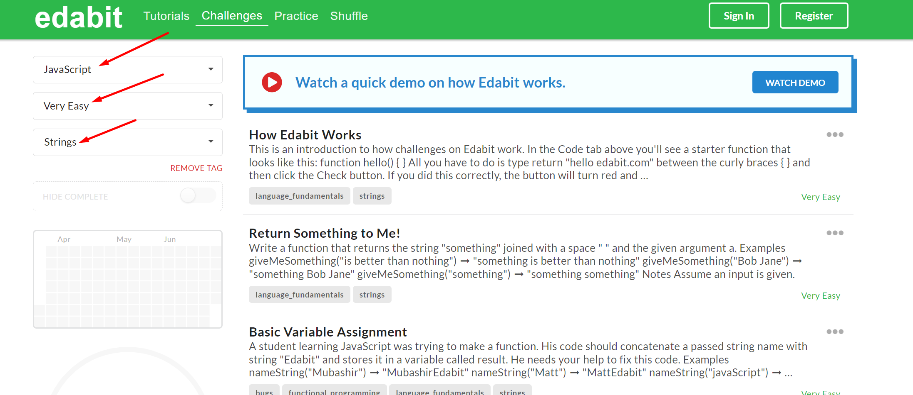

# Functions

1. room.js faile pakeisti pagalbines funkcija i function expression: kubMToLitrai, calcPlotas, checkIfNuber
2. Funkcija, kuri suskaičiuoja simbolių skaičių tekste
   Parašykite funkciją, kuri priima tekstą kaip argumentą ir grąžina simbolių skaičių tame tekste. Pvz., jei paduodame argumentą "Labas", funkcija grąžina 5.
3. Funkcija, kuri patikrina ar skaičius yra lyginis
   Parašykite funkciją, kuri priima skaičių kaip argumentą ir grąžina true, jei skaičius yra lyginis, arba false, jei skaičius yra nelyginis.
4. Funkcija, kuri sujungia du string tipo kitamuoius
   Parašykite funkciją, kuri priima du tekstus kaip argumentus ir grąžina juos sujungtus į vieną eilutę.
5. Sukurti funkciją, kuri padidina tik pirmą žodžio raidę. vienas argumentas. rezultatas gazinamas.
6. Parašykite funkciją, kuri priima argumentą ir patikrina, ar jis yra tekstas ir ar jo ilgis yra didesnis nei 5.
   6.1 ar jo ilgis didesnis uz antra argumenta checkText('aha', 4)

7. Funkcija, kuri tikrina ar skaičius yra nurodyto diapazono viduje
   Parašykite funkciją, kuri priima skaičių ir tikrina, ar jis yra nurodyto diapazono viduje. pvz isDiapazonas(min, max, value),
   isDiapazonas(0, 10, 5) => true
   isDiapazonas(0, 10, 15) => false

8. Parašykite JavaScript funkciją, kuri priima du argumentus: tekstą ir reikšmę. Funkcija turi patikrinti, ar tekstas yra ne tuščias ir ar jame yra nurodyta reikšmė.

Pavyzdys:

```javascript
function arYraReiksme(tekstas, reiksme) {
  // Jūsų kodas čia
}

// Pavyzdys
console.log(arYraReiksme('Labas, pasauli!', 'pasauli')); // Output: true
```

9. Perziureti stringo metodus is https://www.w3schools.com/js/js_string_methods.asp
   9.1 panaudoti viena is metodu su sita verte ' Mike ' kad gauti "Mike"
   9.2 panaudoti viena is metodu kad is "tekstas yra ne tuščias bet" gauti zodeli 'bet'

10. Atskirkite dalį teksto naudojant slice() metodą

Parašykite JavaScript funkciją, kuri priima du argumentus: tekstą ir pradžios bei pabaigos indeksus. Funkcija turi naudoti slice() metodą, kad atskirtų teksto dalį, kuri yra tarp nurodytų indeksų (neįskaitant pabaigos indekso).

```js
function atskirtiTekstoDalį(tekstas, pradžiosIndeksas, pabaigosIndeksas) {
  // Jūsų kodas čia
}

// Pavyzdys
console.log(atskirtiTekstoDalį('Labas, pasauli!', 0, 5)); // Output: "Labas"
```

12. visko perskaityt nereikia bet pasiziureti i kaikuriuos https://www.w3schools.com/jsref/jsref_obj_string.asp

13. Sukurti funkcija kuri priima viena text argumenta ir atskiria ir grazina pirmaji zodi.(indexOf)
    atskirtiZodi("Sveiki siandien yra Ketvirtadinis!") // grazina "Sveiki"
    atskirtiZodi("ar funkcijos yra sunku?") // grazina "ar"
14. Sukurti funkcija kuri priima viena text argumenta ir atskiria ir grazina paskutini zodi.(-----)
    atskirtiZodi("Sveiki siandien yra Ketvirtadinis!") // grazina "Sveiki"
    atskirtiZodi("ar funkcijos yra sunku?") // grazina "ar"

## Edabit

pasiziureti uzduotiu is edabit, is strings, math, validation ir pan


1. https://edabit.com/challenge/MvZK536X7fyrWH8Qc

2. https://edabit.com/challenge/KSTkFSnaYBJdo6PHx

3. https://edabit.com/challenge/yHGowWucg3k2kJdZ4

4. https://edabit.com/challenge/EzbfiquDoAc2Zc9FL

5. https://edabit.com/challenge/9MjEpkL7yAjAqiH58

6. https://edabit.com/challenge/5erCDJ8eJDrXkmwTK

7. ir t.t
